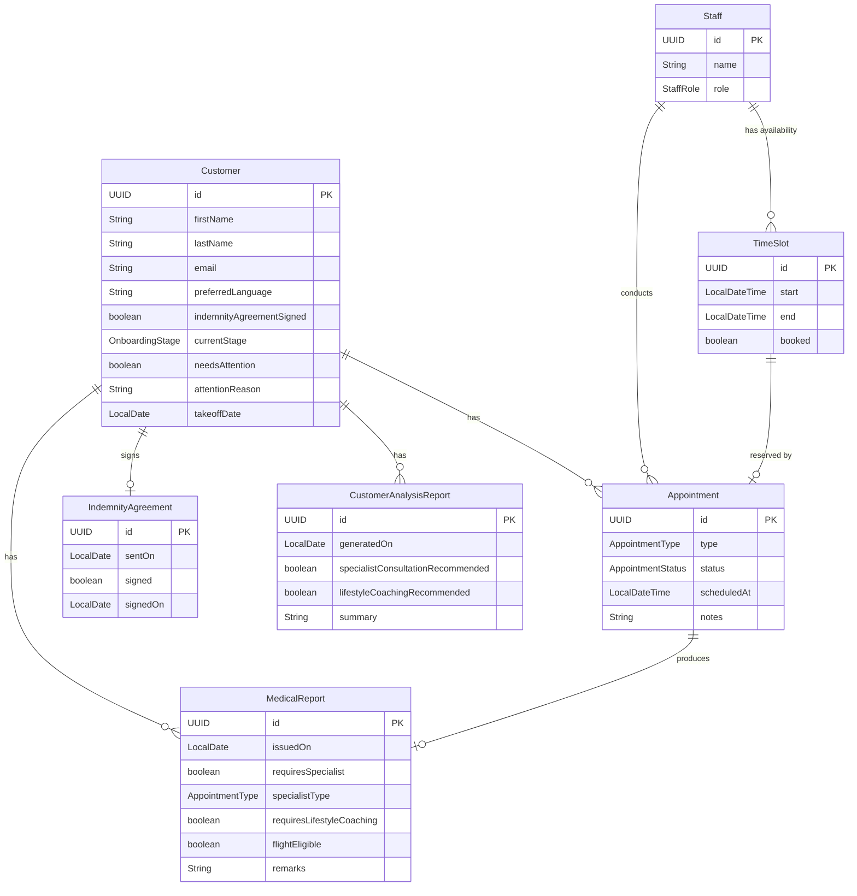

# Entity Relationship Diagram

### Cardinality key
| Notation | Meaning |
|----------|---------|
| `\|\|--o{` | one (mandatory) to zero-or-many |
| `\|\|--o\|` | one (mandatory) to zero-or-one |

### Appointment durations
| Type | Duration |
|------|----------|
| Initial Medical | 60 min |
| Eye Specialist | 45 min |
| Cardiologist | 45 min |
| Neurologist | 45 min |
| Orthopedist | 45 min |
| Psychologist Consultation | 60 min |
| Lifestyle Coaching | 45 min |
| Shuttle Briefing | 90 min |
| Final Medical | 60 min |
