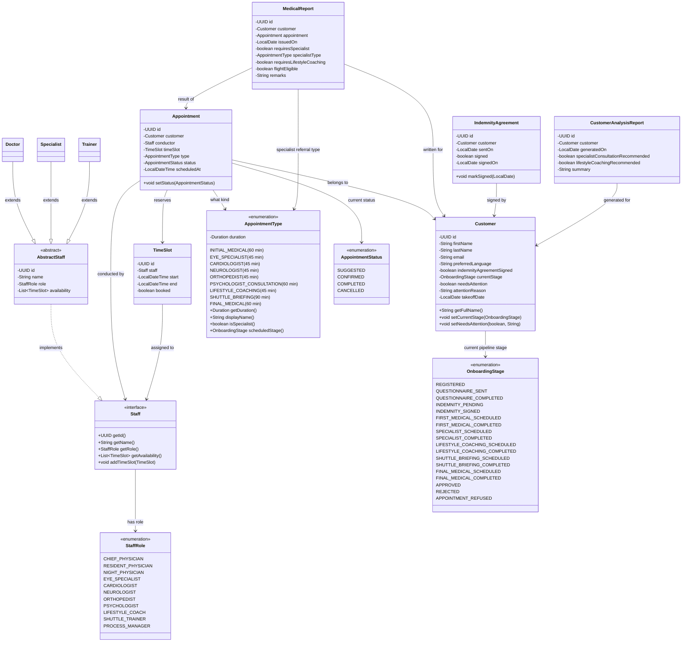
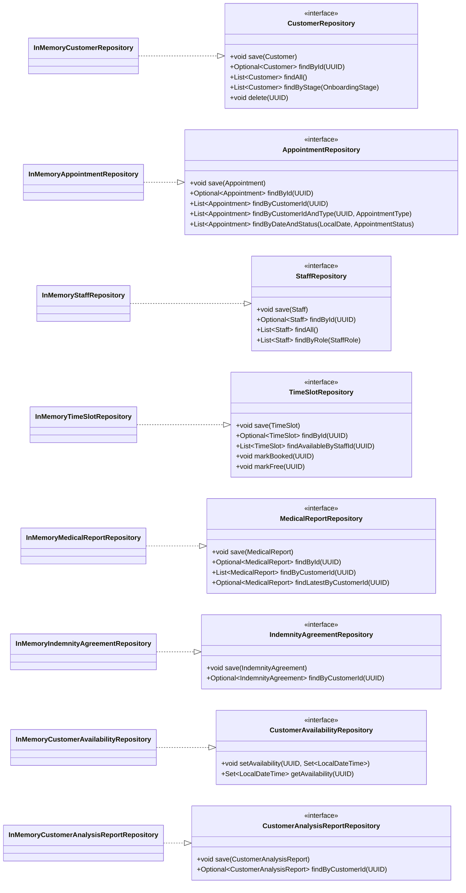
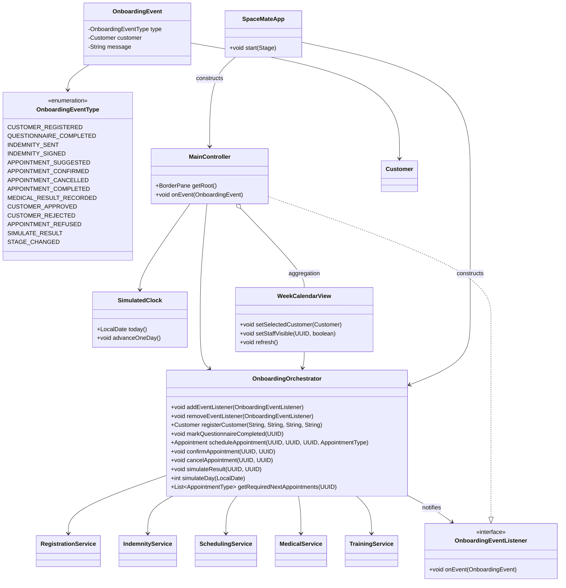

# UML Class Diagram — SpaceMate

The full architecture is split into five focused diagrams, one per layer.
Paste each code block separately into [mermaid.live](https://mermaid.live).

---

## Notation

| Symbol | Meaning |
|--------|---------|
| `◄──` | Dependency: class uses another class |
| `◄..` | Realisation: class implements an interface |
| `◄\|──` | Inheritance: class extends another class |
| `o--` | Aggregation: container holds reference |
| `-` | private visibility |

---

## Diagram 1 — Data Model (`model` package)

> Pure data classes and enums. Staff is an interface implemented by Doctor, Specialist, and Trainer.
> AppointmentType carries duration metadata for scheduling validation.

---

## Diagram 2 — Repository Layer (`repository` package)

> Interfaces define the storage contract. InMemory implementations fulfil it.
> Swapping to a database only requires new implementations — no service changes.

---

## Diagram 3 — Factory Layer (`factory` package)

> Every model object is created through factory interfaces.
> Default implementations live alongside the interfaces.
> Only SpaceMateApp (composition root) instantiates the default factories.

```mermaid
classDiagram
    direction TB

    class CustomerFactory {
        <<interface>>
        +Customer create(UUID, String, String, String)
    }
    class DefaultCustomerFactory

    class StaffFactory {
        <<interface>>
        +Staff create(UUID, String, StaffRole)
    }
    class DefaultStaffFactory

    class TimeSlotFactory {
        <<interface>>
        +TimeSlot create(UUID, Staff, LocalDateTime, LocalDateTime)
    }
    class DefaultTimeSlotFactory

    class AppointmentFactory {
        <<interface>>
        +Appointment create(UUID, Customer, Staff, TimeSlot, AppointmentType, LocalDateTime)
    }
    class DefaultAppointmentFactory

    class MedicalReportFactory {
        <<interface>>
        +MedicalReport create(UUID, Customer, Appointment, LocalDate)
    }
    class DefaultMedicalReportFactory

    class IndemnityAgreementFactory {
        <<interface>>
        +IndemnityAgreement create(UUID, Customer, LocalDate)
    }
    class DefaultIndemnityAgreementFactory

    class CustomerAnalysisReportFactory {
        <<interface>>
        +CustomerAnalysisReport create(UUID, Customer, LocalDate)
    }
    class DefaultCustomerAnalysisReportFactory

    DefaultCustomerFactory ..|> CustomerFactory
    DefaultStaffFactory ..|> StaffFactory
    DefaultTimeSlotFactory ..|> TimeSlotFactory
    DefaultAppointmentFactory ..|> AppointmentFactory
    DefaultMedicalReportFactory ..|> MedicalReportFactory
    DefaultIndemnityAgreementFactory ..|> IndemnityAgreementFactory
    DefaultCustomerAnalysisReportFactory ..|> CustomerAnalysisReportFactory
```

---

## Diagram 4 — Service Layer (`service` package)

> One service per BPMN subprocess. Each service owns exactly one concern.
> Dependencies are injected via constructor (DIP).
> AppointmentTypeStaffResolver is the Strategy that maps appointment types to qualified staff.

```mermaid
classDiagram
    direction TB

    class NotificationService {
        <<interface>>
        +void sendQuestionnaire(Customer)
        +void sendDocumentList(Customer)
        +void sendReminder(Customer, String)
        +void sendAppointmentConfirmation(Customer, String)
        +void sendMedicalResults(Customer, boolean)
    }
    class MockNotificationService

    class CustomerAnalysisService {
        <<interface>>
        +CustomerAnalysisReport analyse(Customer)
    }
    class MockCustomerAnalysisService

    class AppointmentTypeStaffResolver {
        <<interface>>
        +List~Staff~ findQualifiedStaff(AppointmentType)
    }
    class DefaultAppointmentTypeStaffResolver

    class RegistrationService {
        +Customer registerCustomer(String, String, String, String)
        +void markQuestionnaireCompleted(UUID)
        +List~Customer~ getAllCustomers()
    }

    class IndemnityService {
        +IndemnityAgreement sendAgreement(UUID)
        +void recordSigned(UUID)
        +void sendReminder(UUID)
        +Optional~IndemnityAgreement~ getAgreement(UUID)
    }

    class SchedulingService {
        +List~TimeSlot~ findAvailableSlots(AppointmentType)
        +Appointment scheduleAppointment(UUID, UUID, UUID, AppointmentType)
        +void confirmAppointment(UUID)
        +void cancelAppointment(UUID)
        +List~Appointment~ getAppointmentsForCustomer(UUID)
        +List~TimeSlot~ findAvailableSlotsByStaff(UUID)
        +Set~LocalDateTime~ getCustomerAvailability(UUID)
    }

    class MedicalService {
        +MedicalReport recordInitialMedicalResult(UUID, UUID, boolean, boolean, String)
        +MedicalReport recordFinalMedicalResult(UUID, UUID, boolean, String)
        +Optional~MedicalReport~ getLatestReport(UUID)
    }

    class TrainingService {
        +void completeShuttleBriefing(UUID, UUID)
        +void completeLifestyleCoaching(UUID, UUID)
        +void completeSpecialistConsultation(UUID, UUID)
    }

    class CustomerNotAvailableException {
        -String customerName
        -LocalDateTime requestedTime
    }

    MockNotificationService ..|> NotificationService
    MockCustomerAnalysisService ..|> CustomerAnalysisService
    DefaultAppointmentTypeStaffResolver ..|> AppointmentTypeStaffResolver
    CustomerNotAvailableException --|> RuntimeException

    RegistrationService --> CustomerAnalysisService : requests AI analysis
    RegistrationService --> NotificationService : sends questionnaire
    RegistrationService --> CustomerFactory : creates customers
    IndemnityService --> NotificationService : sends document list
    IndemnityService --> IndemnityAgreementFactory : creates agreements
    SchedulingService --> NotificationService : sends confirmation
    SchedulingService --> AppointmentTypeStaffResolver : resolves qualified staff
    SchedulingService --> AppointmentFactory : creates appointments
    MedicalService --> NotificationService : sends results
    MedicalService --> MedicalReportFactory : creates reports
```

---

## Diagram 5 — Orchestration & UI (`orchestration`, `app`, `ui` packages)

> The orchestrator is the single entry point for the UI.
> It coordinates services and fires events to registered listeners (Observer pattern).
> SpaceMateApp is the composition root — all wiring happens there.

